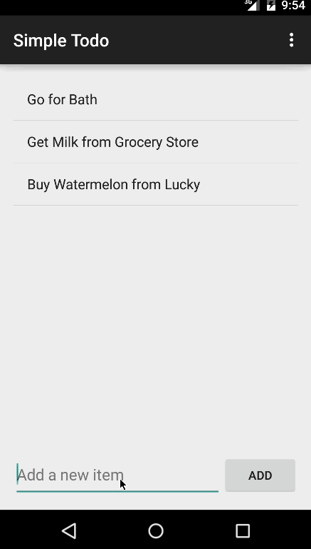

# Todo App Demo
This is an Android application for displaying & Editing Todo Items.

Time spent: 8 hours spent in total

Completed user stories:

 * [x] Setup your Android environment
 * [x] Build initial todo app
 * [x] Add edit functionality to todo app
 * [x] Optional: Persist the todo items into SQLite instead of a text file
 * [x] Optional: Improve style of the todo items in the list using a custom adapter

Walkthrough of all user stories:

GIF created with [LiceCap](http://www.cockos.com/licecap/).
